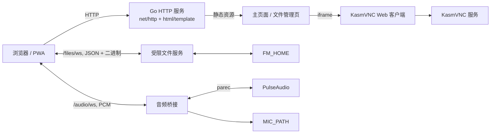

# Kclient Go 架构说明

## 项目定位

Kclient 是 KasmVNC 的 Go 包装层，而不是 VNC 服务端。它提供 Web 页面、嵌入 KasmVNC Web 客户端，并额外实现容器文件管理与双向 PCM 音频桥接。

本次迁移移除了 Node.js、Express、EJS、Socket.IO 和 `pulseaudio2` 依赖。服务端现在是单个 Go 进程，前端实时通信使用浏览器原生 WebSocket。

## 模块边界

| 区域 | 实现 | 职责 |
| --- | --- | --- |
| 启动与配置 | `main.go` 的 `main`、`loadConfig` | 读取环境变量、确保 `FM_HOME` 存在、启动 HTTP 服务。 |
| HTTP 与模板 | `routes`、`home`、`manifest` | 在 `SUBFOLDER` 下提供页面、PWA manifest、静态资源与 KasmVNC 资源映射。 |
| 文件 WebSocket | `fileWS` | JSON 控制消息和二进制上传/下载；提供浏览、创建、删除、上传、下载。 |
| 文件安全层 | `safePath`、`existingAncestor` | 将所有虚拟路径绑定至 `FM_HOME`，防止 `..` 与符号链接逃逸。 |
| 音频 WebSocket | `audioWS`、`streamAudio` | 启动可配置 `parec` 子进程读取桌面 PCM，并接收浏览器麦克风 PCM。 |
| 前端 | `public/index.html`、`public/js/*.js` | KasmVNC iframe、音频播放/采集、文件浏览器 UI 与原生 WebSocket 客户端。 |

## HTTP 路由

全部路由由 `SUBFOLDER` 挂载，默认前缀为 `/`：

| 路由 | 作用 |
| --- | --- |
| `/` | 渲染主界面。 |
| `/public/*` | CSS、JavaScript、图标等本仓库静态资源。 |
| `/vnc/*` | `KASMVNC_WEB_ROOT`（默认 `/usr/share/kasmvnc/www`）的静态资源。 |
| `/files` | 文件浏览器 iframe 页面。 |
| `/files/ws` | 文件操作 WebSocket。 |
| `/audio/ws` | 音频 WebSocket。 |
| `/manifest.json`、`/favicon.ico` | PWA 元数据与图标。 |

## WebSocket 协议

文件通道的文本帧是 JSON：

| 方向 | 消息 | 语义 |
| --- | --- | --- |
| 客户端 → 服务端 | `open`、`getfiles` | 获取根目录或指定虚拟目录。 |
| 客户端 → 服务端 | `download` | 请求文件；服务端先发 `download` 元数据，再发二进制内容。 |
| 客户端 → 服务端 | `upload` + 二进制帧 | 先发送目标路径，再紧接发送文件数据。单帧上限 200 MB。 |
| 客户端 → 服务端 | `mkdir`、`delete` | 创建目录或删除文件/目录。 |
| 服务端 → 客户端 | `renderfiles`、`error` | 目录列表或明确的错误反馈。 |

音频通道：浏览器以 `{ "type": "open" }` / `{ "type": "close" }` 控制 PulseAudio 读取；桌面音频和麦克风音频均为二进制 Int16 little-endian PCM。默认格式是 44.1 kHz、双声道。`PULSE_RECORD_COMMAND` 允许按实际音频环境替换采集命令。

## 安全与运行边界

- 文件 API 的路径是相对 `FM_HOME` 的虚拟路径；服务端验证规范化结果、已有父目录和符号链接，禁止越过根目录。
- WebSocket 升级默认假设同源部署。生产环境应在反向代理或应用层配置认证、TLS、严格 Origin 策略及访问日志。
- 删除操作仍是不可恢复的递归删除；生产 UI 应增加明确确认，并建议在存储层提供回收站或快照。
- 音频采集依赖运行容器可执行 `parec`；无法启动时仅音频功能失败，HTTP 和文件功能仍可用。
- 上传目前为整文件内存传输，200 MB 限制用于控制单连接内存压力。需要更大文件时，应演进为分块或流式协议。

## 配置

| 变量 | 默认值 | 含义 |
| --- | --- | --- |
| `LISTEN_ADDR` | `:6900` | HTTP 监听地址。 |
| `SUBFOLDER` | `/` | URL 前缀。 |
| `TITLE` | `KasmVNC Client` | 页面标题。 |
| `FM_HOME` | `/config` | 文件服务根目录。 |
| `KASMVNC_WEB_ROOT` | `/usr/share/kasmvnc/www` | KasmVNC Web 文件目录。 |
| `MIC_PATH` | `/defaults/mic.sock` | 麦克风 PCM 输出位置。 |
| `PULSE_RECORD_COMMAND` | `parec --device=auto_null.monitor --format=s16le --rate=44100 --channels=2` | PulseAudio 录音命令。 |

## 验证与后续建议

已使用 `go build ./...` 和 `go vet ./...` 验证 Go 源码。后续建议补充 HTTP/WebSocket 集成测试、认证中间件、可恢复删除策略，以及流式文件上传。
